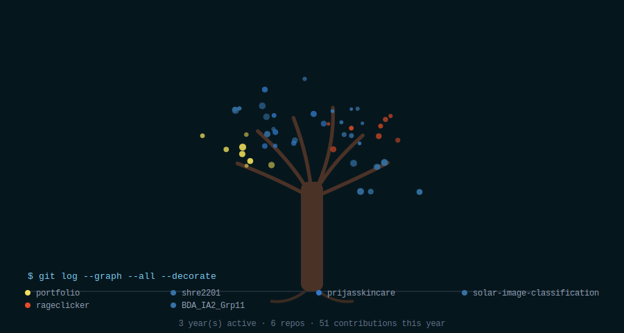
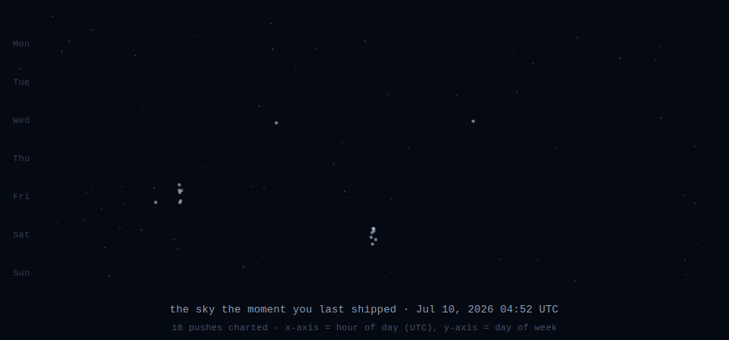
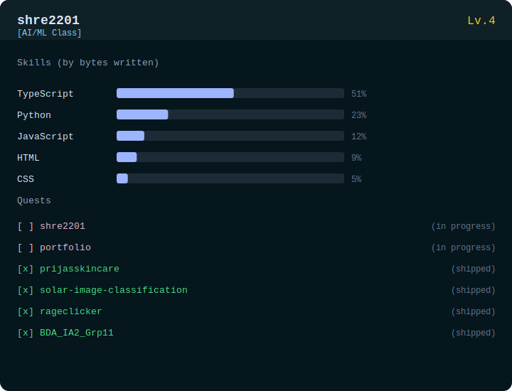

### Shreshtha Agarwal

AI/ML Enthusiast · Student

[Portfolio](https://your-portfolio-link.com) · [LinkedIn](https://linkedin.com/in/shreshthaagarwal) · [Email](mailto:agarwalshreshtha223@gmail.com)

---

<h3><code>// hello</code></h3>

I am **Shreshtha**, a student who enjoys building clean interfaces, practical
tools, and small systems that make everyday work smoother. This profile is a
home for projects, experiments, notes, and the things I am learning.

`AGI` · `Data Science` · `Machine learning` · `CNNs` · `Transformers` · `RAG`

---

<h3><code>// grown from git history</code></h3>

A tree grown from real activity: repos are branches (colored by dominant language), this year's contributions are leaves, account age sets the trunk.

---

<h3><code>// commit constellation</code></h3>

Recent pushes plotted as stars — hour of day sets position, day of week sets the band, commit count sets brightness.

---

<h3><code>// character sheet</code></h3>

XP bars from real language bytes across my repos; quests are those repos, marked shipped or in progress by how recently they were pushed to.

---

<h3><code>// github pulse</code></h3>

 

---

