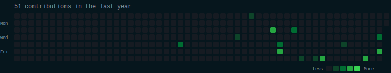
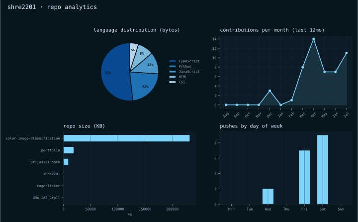

### Shreshtha Agarwal

Data Scientist · AI/ML Enthusiast

[Portfolio](https://your-portfolio-link.com) · [LinkedIn](https://linkedin.com/in/shreshthaagarwal) · [Email](mailto:agarwalshreshtha223@gmail.com)

---

<h3><code>// hello</code></h3>

I am **Shreshtha**, a student who enjoys building clean interfaces, practical
tools, and small systems that make everyday work smoother. This profile is a
home for projects, experiments, notes, and the things I am learning.

`AGI` · `Data Science` · `Machine learning` · `CNNs` · `Transformers` · `RAG`

---

<h3><code>// live query</code></h3>

Not a mockup — this actually queries my GitHub stats every day.

---

<h3><code>// repo analytics</code></h3>

Four real numbers, not decoration: language mix by bytes written, monthly contribution trend, repo size, and which days I actually push code.

---

<h3><code>// github pulse</code></h3>

 

---

