<div align="center">


</div>

```bash
shreshtha@github:~$ whoami
> Shreshtha

shreshtha@github:~$ cat ./profile.txt
> AI and ML enthusiast 
> I like turning loose ideas into useful, polished projects.
> Currently exploring software, automation, and AI tools.
> Always improving one commit, one experiment, and one shipped thing at a time.


shreshtha@github:~$ open ./links
> Portfolio: In making
> LinkedIn:  https://linkedin.com/in/shreshthaagarwal
> GitHub:    https://github.com/shre2201
> Email:     agarwalshreshtha223@gmail.com
```

---

<h3><code>// hello</code></h3>

I am **Shreshtha**, a student who enjoys building clean interfaces, practical
tools, and small systems that make everyday work smoother. This profile is a
home for projects, experiments, notes, and the things I am learning.

→ Portfolio: [in making](https://your-portfolio-link.com)  
→ LinkedIn: [linkedin.com/in/shreshthaagarwal](https://linkedin.com/in/shreshthaagarwal)  
→ Email: agarwalshreshtha223@gmail.com

---

<h3><code>// focus areas</code></h3>

<div align="center">

`AGI` · `Data Science` · `Machine learning` · `CNNs` · `Transformers` · `RAG`

</div>

---

<h3><code>// tech stack</code></h3>

<div align="center">

[](https://www.python.org/)
[](https://developer.mozilla.org/en-US/docs/Web/JavaScript)
[](https://www.typescriptlang.org/)
[](https://react.dev/)
[](https://nodejs.org/)
[](https://git-scm.com/)
[](https://developer.mozilla.org/en-US/docs/Web/HTML)
[](https://developer.mozilla.org/en-US/docs/Web/CSS)

</div>

---

<h3><code>// github pulse</code></h3>

<div align="center">

<a href="https://github.com/shre2201">
  
</a>

<br/>

<a href="https://github.com/shre2201">
  
</a>

</div>

---

<div align="center">



<br/>


</div>
